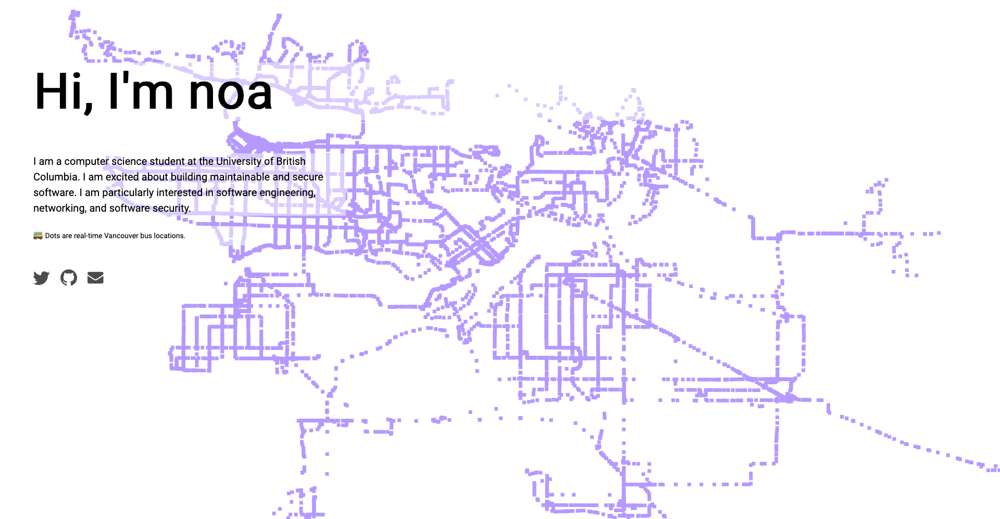

# noa.dev

This is the source code for my new personal homepage. It features live bus locations for Vancouver as a background. Its neat because if you leave the page open, you will see a map of the city emerge using live data.

